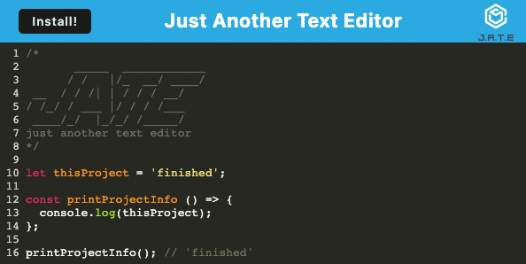

# Dan-Smith-14-Model-View-Controller--MVC--Tech-Blog

**Description**
---

**Description**
---

This text editor project is a progressive web app that is installable and can be run offline. It uses both local storage and indexedDB to store the users code. It saved the code when the editor section loses focus and loads the previous state on initialization. The app uses webpack to bundle the JavaScript code.  

**Live Website**
---

Link:
https://text-editor-pwa-dan-smith.herokuapp.com/

**Technologies Used**
---

- Node JS
- Express JS
- Webpack
- IDBDatabase
- Workbox
